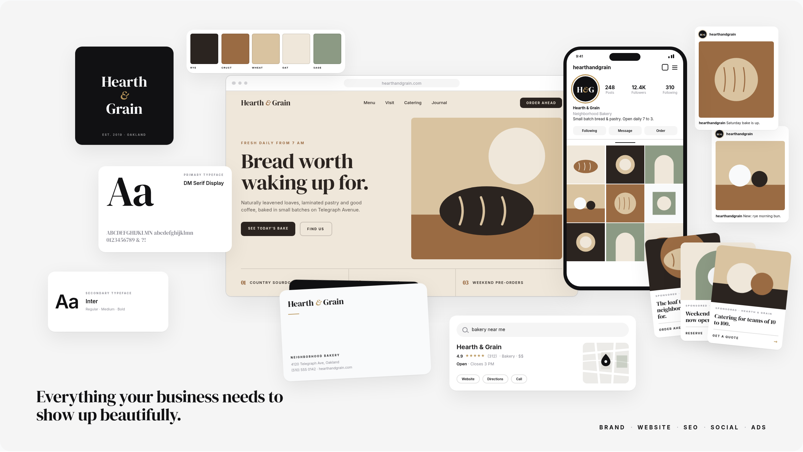

# Small Business Showcase · UX Signal Studio

An animated "entire digital presence" section for the Small Business page:
brand, website, social, ads and search revealed around a central website in
a seamless 16 second loop: brand assembles in the centre, moves aside as the
website opens from the centre, then Google search/Maps, Instagram and ads,
ending on the full composition.



## Run

```bash
npm install
npm run dev          # preview harness at /
npm run build && npm run preview
node scripts/shoot.mjs   # renders QA frames into ./screenshots (needs preview running)
```

## Where things live

```
src/components/SmallBusinessShowcase/
  SmallBusinessShowcase.tsx  section, canvas, viewport pause
  pieces.tsx                 website, phone, cards (layout only, no timing)
  showcase-data.ts           CONTENT: copy, images, fonts, palette
  showcase-motion.ts         ANIMATION: timeline, layouts, CSS compiler
  assets/placeholder-*.svg   stand-in art, replace with real assets
src/brand/tokens.ts          mirror of IndexV2 tokens (see below)
src/pages/SmallBusiness.tsx  preview harness only
```

### Replacing content (no animation changes)

All in `showcase-data.ts`:

| Slot | Field |
|------|-------|
| Website | `website.screenshot` (full 16:10 image) or edit the typeset mock fields |
| Logo | `brand.logo` (falls back to the typeset wordmark) |
| Fonts | `brand.typefaces.primary/secondary.family` |
| Palette | `brand.palette` |
| Instagram | `instagram.grid` (9), `instagram.featured` (2) |
| Ads | `ads` (3) |
| Google / search | `search` |

Every image is `{ src, avif?, webp?, alt }` and renders through `<picture>`
with `loading="lazy"`.

### Retiming / recomposing

`showcase-motion.ts` holds every number: `TIMELINE` (entrances), `ADS_FAN`,
`INNER` (grid, swatches, typing), `EXIT`, `CAPTIONS`, and `LAYOUTS`
(desktop 1600x900 stage, mobile 900x1600 stage, `intro` centre positions
for the brand pieces, camera paths). The camera's
last stop equals its first and the loop starts and ends on an empty canvas,
which is what makes it seamless.

## How it runs

- The timeline compiles to CSS `@keyframes` using only `transform`,
  `opacity` and `clip-path`. No per-frame JavaScript, no React state, no
  re-renders while playing. Framer Motion was not needed.
- Everything is sized in stage units (`--u = container width / stage width`),
  so text and edges stay sharp at every size and the canvas reserves its
  space with `aspect-ratio` (no layout shift).
- An `IntersectionObserver` flips `data-playing`; the loop pauses when less
  than 25% of the canvas is visible and starts from frame 0 on first view.
- `prefers-reduced-motion: reduce` shows the final ecosystem frame, static.
  This rule overrides the site-wide reduced-motion rule in `styles.css`,
  which would otherwise shrink the loop to 0.001ms and strobe.
- Tablet (640 to 1023px) hides the secondary typeface card, second post and
  middle ad. Mobile (below 640px) swaps to a dedicated 9:16 composition.

## Moving it into the Lovable project

1. Copy `src/components/SmallBusinessShowcase/` into the project.
2. Replace `@/brand/tokens` imports with `@/pages/IndexV2` (same names), and
   keep `SHADOW_CARD`, `RADIUS`, `EASE_OUT` locally or add them there.
3. Add a `/small-business` route that renders `<SmallBusinessShowcase />`.
   DM Serif Display needs to be loaded; the project currently only imports
   Inter from Google Fonts and falls back to Noto Serif Display.
